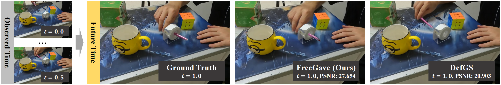

# FreeGave: 3D Physics Learning from Dynamic Videos by Gaussian Velocity (CVPR2025)

<h4 align="center">

[](./LICENSE)
[](https://arxiv.org/abs/2506.07865)

<p>
    
</p>

</h4>

This repository will contain the official implementation of the paper: *FreeGave: 3D Physics Learning from Dynamic Videos by Gaussian Velocity*.
FreeGave is a framework that learns 3D geometry, appearance and velocity purely from multi-view videos, achieving SOTA performance in future extrapolation task on four datasets. 

Please feel free to contact us via [jinxi.li@connect.polyu.hk](jinxi.li@connect.polyu.hk) or open an issue if you have any questions or suggestions.

## 📹 Demo

<p>
    
</p>


## 📢 News
- **2025-06-14**: Our poster is successfully presented in Nashville！ 
- **2025-02-26**: FreeGave is accepted by CVPR2025 🎉！ 

## 📋 TODO
- [x] Submit the paper onto arXiv. 
- [x] Release training codes. 
- [x] Release FreeGave-GoPro dataset.
- [ ] Release pretrained checkpoints.


## ⚙️ Installation
```shell script
git clone https://github.com/vLAR-group/FreeGave.git --recursive
cd FreeGave

### CUDA 11.6
conda env create -f env.yml
conda activate freegave

# install pytorch 1.13.1
conda install pytorch==1.13.1 torchvision==0.14.1 torchaudio==0.13.1 pytorch-cuda=11.6 -c pytorch -c nvidia

# install gaussian requirements
pip install submodules/depth-diff-gaussian-rasterization
pip install submodules/simple-knn
```

## 🔑 Usage
We include in-detail training (both *commends* and per-scene *hyperparameters*) and evaluation 
instructions in `train_eval.sh` file. You just need to download the dataset and modify the path to the
data accordingly. 

Notably, we provide training visualization, for which you just need to add
`--gui` flag to the training command (but this will increase the GPU usage and the training time
significantly, so we only recommend using it for debugging). 
After modifying the path, simply run the following commend:

```shell script
bash train_eval.sh
````

## 💾 Datasets
All the datasets will be uploaded soon. We organize the dataset following [D-NeRF](https://github.com/albertpumarola/D-NeRF) convention.
We split the dataset as:
- **train**: contains the frames within observed time interval, used for training the model.
- **val**: contains the frames within observed time interval but for novel views, used for evaluating *novel-view interpolation*.
- **test**: contains the frames in unobserved **future** time for both observed and novel views, used for evaluating *future extrapolation*.

Datasets can be downloaded from HuggingFace: 
- [Dynamic Objects](https://huggingface.co/datasets/scintigimcki/DynamicObjects)
- [Dynamic Indoor Scenes](https://huggingface.co/datasets/scintigimcki/DynamicIndoorScenes)
- [FreeGave-GoPro](https://huggingface.co/datasets/scintigimcki/FreeGave-GoPro)


## 😊 Acknowledgement
This work is adapted from [Deformable-3DGS](https://github.com/ingra14m/Deformable-3D-Gaussians) and [NVFi](https://github.com/vLAR-group/NVFi),
and we would like to thank the authors for their great work.


## 📚 Citation
If you find our work helpful, please consider citing:
```bibtex
@article{li2025freegave,
  title={FreeGave: 3D Physics Learning from Dynamic Videos by Gaussian Velocity}, 
  author={Jinxi Li and Ziyang Song and Siyuan Zhou and Bo Yang},
  year={2025},
  journal={CVPR}
}
```
